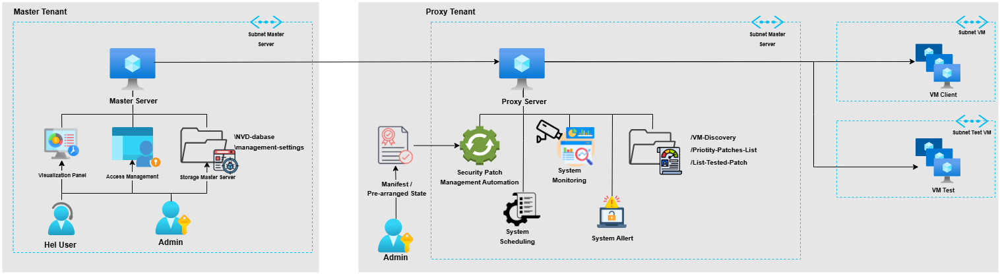

# Security Patch Manager

## Automated Patch Management for B2B IaaS Environments
## 📌 Overview

Questo progetto propone un modello preliminare di **Security Patch Management (SPM)** pensato per ambienti **B2B multi-tenant** in ambito **Infrastructure-as-a-Service (IaaS)**.  
L’obiettivo è definire un processo centralizzato, automatizzato e sicuro per la gestione delle patch, ponendo le basi per una futura architettura completa.

La soluzione è progettata con riferimento al contesto del **Polo Strategico Nazionale (PSN)** e integra standard internazionali come **IEC/ISO 62443**, **ISO/IEC 27002**, **NIST SP 800-40**, e **NERC CIP-007**.

---
## 🎯 Project Goals

- Creare una **visione unificata e aggiornata** di tutte le risorse gestite (VM, sistemi operativi, patch installate o mancanti).
- Definire un sistema che identifichi automaticamente patch di sicurezza, le classifichi e ne valuti l’impatto.
- Minimizzare gli effetti sui sistemi di produzione, rispettando il principio di **zero downtime** e le esigenze dei tenant.
- Strutturare un processo scalabile e automatizzabile, per supportare ambienti **eterogenei e multi-cloud**.

---
## 🏗️ High-Level Architecture

Il modello introduce due componenti principali:

### **Master Server**

- Repository centrale per inventario, vulnerabilità, politiche e monitoraggio.
- Responsabile del download e aggiornamento della **National Vulnerability Database (NVD)**.
- Gestisce la comunicazione sicura con i Proxy e la segregazione dei tenant.

### **Proxy Server (Smart Proxy)**

- Installato nei tenant, esegue discovery, analisi, test e deployment in locale.
- Coordina l’intero ciclo di patching senza esporre sistemi di produzione al Master Server.
- Garantisce isolamento, sicurezza e coerenza.

---
## 🔄 Patch Management Workflow

### **P1 — [Active Environment Discovery](./workflow/Active_Environment_Discovery-SPM.drawio)**
### **P2 — [Security Discovery & Prioritization](./workflow/Security_Patch_Discovery_&_Prioritization.drawio)**

Due modalità operative:
- **Security Mode** — priorità basate esclusivamente sul rischio.
- **Smart Mode** — valutazione combinata di rischio, dipendenze, stabilità e impatto operativo.
### **P3 — [Patch Testing](./workflow/PATCHTESTING_VALIDATION.drawio)**
### **P4 — [Patch Deployment](./workflow/PATCH_INSTALLATION_ENGINE.drawio)**

### **(Opzionale) P5 — Post-Deployment Assessment**

---
## 🔐 Utenze

- 🔑 [ASL0603](./Utenze/ASL0603.md)

---
## ⚙️ Setup Git & Obsidian
- 🎬 [Youtube Tutorial](https://www.youtube.com/watch?v=Cu4-BPcveBI)
- git command
## Windows:
- Git: https://git-scm.com/download/win
- GitHub Desktop: https://desktop.github.com/download/
- Generate Keys (use your email): `ssh-keygen -t ed25519 -C "your-email@example.com"`
- Start SSH Agent: `eval "$(ssh-agent -s)"`
- Add Key: `ssh-add ~/.ssh/id_ed25519`
- Use Key: `echo -e "Host github.com\n  HostName github.com\n  User git\n  IdentityFile ~/.ssh/id_ed25519\n  AddKeysToAgent yes" > ~/.ssh/config`
- Modify File Permissions: `chmod 600 ~/.ssh/config`
- Copy Key to Clipboard: `clip < ~/.ssh/id_ed25519.pub`
- Add Key to GitHub: https://github.com/settings/keys

---
## 👤 Author

**Alberto Ameglio**  
