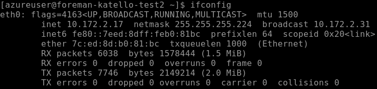
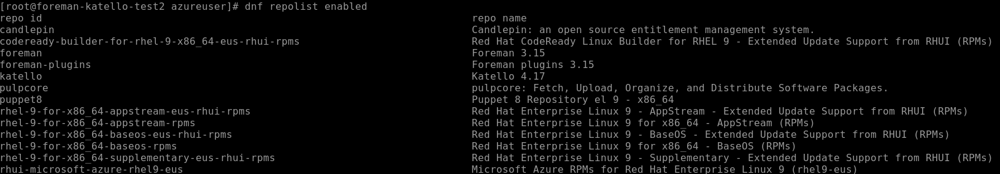
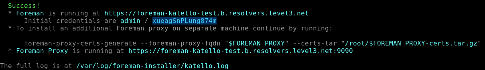
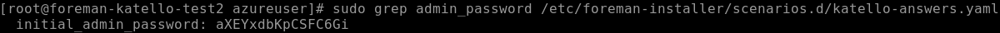

In questa guida mostrerò come installare Forman con Puppet, Katello e il plugin Discovery. Vedremop come installare e configurare i server DHCP e TFTP. Mostrerò anche come configurare Foreman e come utilizzare l'immagine di avvio di Foreman tramite PXE.
## Setup check
```bash
cat /etc/os-release
```
```bash
rpm -q selinux-policy
```


Si vede la versione `selinux-policy-38.1.35-2.el9_4.3 ← è troppo vecchia`. Per questo setup stiamo usando **RHEL 9.4** OS presente come ISO su azure, ma i pacchetti SELinux di Foreman/Katello che vogliamo installanlare richiedono almeno : 
- `selinux-policy >= 38.1.45-3.el9_5`
- `selinux-policy >= 38.1.53-5.el9_6`
Aggiorniamola: 
```bash
sudo su
```
```bash
sudo subscription-manager register
```
E' necessario registrare una sottoscrizione RHEL, in quasteso caso sto usando la mia personale gratuita, _situazione da migliorare magari caricando su azure una ISO già compatibile è più aggionata_. 
```bash
sudo subscription-manager repos --enable=rhel-9-for-x86_64-baseos-rpms
```
```bash
sudo subscription-manager repos --enable=rhel-9-for-x86_64-appstream-rpms
```
```bash
sudo dnf upgrade --releasever=9.6 -y
```
```bash
sudo reboot
```
Dopo il riavvio controllare se la verione è stata aggiornata correttamente.
```bash
rpm -q selinux-policy
```

- assicuriamoci di avere un hostname statico
- Ricaviamoci il NIC a IP 
```bash
ifconfig
```


In questo caso il NIC eth0 e l'IP 10.172.2.17
- verifichiamo l'hostname se non se siamo sicuri
```bash
hostname 
```
Per una procedura standard in questo momento dovremmo cercare il dominio del DNS per una corretta configurazione del hest. 
in questo modo
```bash
nmcli device show enp2s0 | grep IP4.DNS
```
ci aspetta un Output simile `DNS-Server-IP: IP4.DNS[1]: 192.168.2.1`
```bash
nslookup 192.168.2.1
```
ci aspetta un Output simile `1.2.168.192.in-addr.arpa name = speedport.ip.`
Essendo noi in un laboratorio test ed unico interesse in questo momento che il servizio venga raggiunto solamente da un host all'interno della stessa subnet aggiriamo il problema.
## edit il file hosts
- edit `/etc/hosts`
```bash
sudo nano /etc/hosts
```
IL dominio per la mappatura di un nuov host dovrebbe essere: `<host name+routers domain> <host name>` nel nostro ambiente di test seguendo l'esempio di prima inseriremo l'IP 10.172.2.17 hostname della macchina e `.localdomain` seguendo la logical del file. Dovremmo ottenere un risultato simile.

nel caso di una non limitazione di laboratorio per il DNS il risultato sarebbe stato `10.172.2.17 foreman-katello-test2speedport.ip. foreman-katello-test2` o qualcosa di simile.
## Settiamo le regole del firewall
```bash
firewall-cmd --add-port="5646/tcp"
```
```bash
firewall-cmd \  
--add-port="5647/tcp" \  
--add-port="8000/tcp" \  
--add-port="9090/tcp"
```
```bash
firewall-cmd \  
--add-service=dns \  
--add-service=dhcp \  
--add-service=tftp \  
--add-service=http \  
--add-service=https \  
--add-service=puppetmaster
```
```bash
firewall-cmd --runtime-to-permanent
```
Verifichiamo che tutto sia venuto correttamente.
```bash
firewall-cmd --list-all
```
Ci aspettiamo un output simile


Ora possiamo iniziare con l'installazione dei Foreman-Katello. Seguima dunque quanto riporato dalla guida per instllare verione di Foreman 3.15 Katello 4.17 e Puppet 8 https://docs.theforeman.org/3.15/Quickstart/index-katello.html
## Configurazione dei repository
1. Cancelliamo tutti i metadati:
```bash
dnf clean all
```
2. Installare il pacchetto foreman-release.rpm:
```bash
dnf install https://yum.theforeman.org/releases/3.15/el9/x86_64/foreman-release.rpm
```
3. Installa il pacchetto katello-repos-latest.rpm:
```bash
dnf install https://yum.theforeman.org/katello/4.17/katello/el9/x86_64/katello-repos-latest.rpm
```
4. Installa il pacchetto puppet-release.
```bash
dnf install https://yum.puppet.com/puppet8-release-el-9.noarch.rpm
```
Verifichiamo che tutto sia vvenuto correttamente. 
```bash
dnf repolist enabled
```
Dovremmo ottenere un risultato simile.

## Installazione dei pacchetti del server Foreman
1. Aggiorniamo tutti i pacchetti:
```bash
dnf upgrade
```
1. Installiamo `foreman-installer-katello`:
```bash
dnf install foreman-installer-katello
```
## Lanciamo l'installer di Foreman per katello
L'installazione non è interattiva, ma la configurazione può essere personalizzata specificando una qualsiasi delle opzioni elencate in foreman-installer --help, oppure eseguendo foreman-installer -i per la modalità interattiva. Ulteriori esempi sono descritti nella sezione Opzioni di installazione. L'opzione -v disabilita la barra di avanzamento e visualizza tutte le modifiche.
```bash
foreman-installer --scenario katello
```
Dovremmo ottenere un risultato simile. 

Come si vede nell'output queste sono le credenziali con la password generate per accedere a foreman. `Initial credentials are admin / aXEYxdbKpCSFC6Gi`
Il servizio è operativo a `https://foreman-katello-test2.localdomain` però nel nostro in assenza di DNS possiamo contattare la macchina al'indirizzo ip https://10.172.2.17

In caso non riuscimmo ad ottenere le password dall'output possiamo andarle a ricavare con il comando:
```bash
sudo grep admin_password /etc/foreman-installer/scenarios.d/katello-answers.yaml
```
User di default rimane sempre admin.


