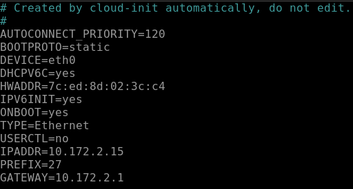
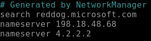
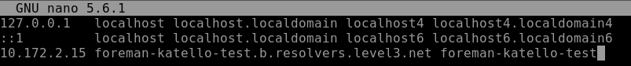
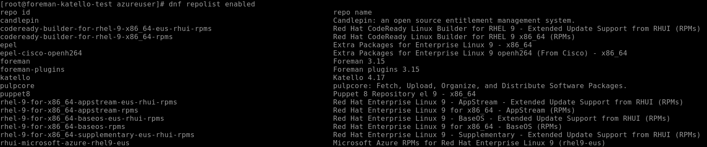

## Setup check
```bash
cat /etc/os-release
```
```bash
rpm -q selinux-policy
```


Si vede la versione `selinux-policy-38.1.35-2.el9_4.3 ← è troppo vecchia`. Per questo setup stiamo usando **RHEL 9.4** OS presente come ISO su azure, ma i pacchetti SELinux di Foreman/Katello che vogliamo installanlare richiedono almeno : 
- `selinux-policy >= 38.1.45-3.el9_5`
- `selinux-policy >= 38.1.53-5.el9_6`
Aggiorniamola: 
```bash
sudo su
```
```bash
sudo subscription-manager register
```
E' necessario registrare una sottoscrizione RHEL, in quasteso caso sto usando la mia personale gratuita, _situazione da migliorare magari caricando su azure una ISO già compatibile è più aggionata_. 
```bash
sudo subscription-manager repos --enable=rhel-9-for-x86_64-baseos-rpms
```
```bash
sudo subscription-manager repos --enable=rhel-9-for-x86_64-appstream-rpms
```
```bash
sudo dnf upgrade --releasever=9.6 -y
```
```bash
sudo reboot
```
Dopo il riavvio controllare se la verione è stata aggiornata correttamente.
```bash
rpm -q selinux-policy
```

## Mount di un disco dedicato alle repository su `/var/lib/pulp` tramite **LVM**
Verifica la presenza del secondo disco:
```bash
lsblk
```

## Inizializza il disco dedicato con LVM
Crea la tabella delle partizioni sul disco sdb o sba da individuare nel passaggio precedente
```bash
sudo parted /dev/sda --script mklabel gpt
```
```bash
sudo parted /dev/sda --script mkpart primary 0% 100%
```
#### Crea Physical Volume (PV)
```bash
sudo pvcreate /dev/sda1
```
#### Crea Volume Group (VG)
Lo definisci in modo che sia dedicato a Pulp:
```bash
sudo vgcreate pulpgvg /dev/sda1
```
#### Crea Logical Volume (LV)
```bash
sudo lvcreate -n pulplv -l 100%FREE pulpgvg
```
#### Formatta il filesystem
Consigliato: **XFS** (Pulp lavora meglio con blocchi grandi)
```bash
sudo mkfs.xfs /dev/pulpgvg/pulplv
```
## Monta il volume su /var/lib/pulp
Crea la directory se non esiste:
```bash
sudo mkdir -p /var/lib/pulp
```
Aggiungi la entry in fstab:
```bash
echo '/dev/pulpgvg/pulplv /var/lib/pulp xfs defaults 0 0' | sudo tee -a /etc/fstab
```
Monta tutto:
```bash
sudo mount -a
```
Esegui il reload di systemd
```bash
sudo systemctl daemon-reload
```
## Verifica che il mount sia attivo
```bash
df -h /var/lib/pulp
```
Dovresti ottenere qualcosa di similie:

## Impostare un host statico
```bash
nano /etc/sysconfig/network-scripts/ifcfg-eth0
```
eg. → Change e set `BOOTPROTO=static` add `IPADDR=172.20.10.10` add `PREFIX=24` add `GATEWAY=172.20.10.1`

Spegni e accendi l'interfaccia di rete
```bash
sudo ip link set eth0 down && sudo ip link set eth0 up

```
Verifica
```bash
ip a
```
```bash
route -n
```
## Set di un DNS statico pubblico
```bash
nano /etc/resolv.conf
```
add `nameserver 4.2.2.2`

## Set del hostname
```bash
hostname foreman-katello-test
```
```bash
hostnamectl set-hostname foreman-katello-test
```
- Ricaviamoci il NIC a IP 
```bash
ifconfig
```

In questo caso il NIC eth0 e l'IP 10.172.2.17
- verifichiamo l'hostname se non se siamo sicuri
```bash
hostname 
```
Per una procedura standard in questo momento dovremmo cercare il dominio del DNS per una corretta configurazione del hest. 
in questo modo
```bash
nmcli device show eth0 | grep IP4.DNS
```
ci aspetta un Output simile `DNS-Server-IP: IP4.DNS[1]: 192.168.2.1`
```bash
nslookup 4.2.2.2
```
ci aspetta un Output simile `1.2.168.192.in-addr.arpa name = b.resolvers.level3.net.
## edit il file hosts
- edit `/etc/hosts`
```bash
sudo nano /etc/hosts
```
IL dominio per la mappatura di un nuov host dovrebbe essere: `<host name+routers domain> <host name>` nel nostro ambiente di test seguendo l'esempio di prima inseriremo l'IP 10.172.2.15 hostname della macchina e `b.resolvers.level3.net.` seguendo la logical del file. Dovremmo ottenere un risultato simile.

Nel caso di una non limitazione di laboratorio per il DNS il risultato sarebbe stato `10.172.2.15 foreman-katello-test.b.resolvers.level3.net. foreman-katello-test` o qualcosa di simile.
## Settiamo le regole del firewall
```bash
firewall-cmd --add-port="5646/tcp"
```
```bash
firewall-cmd \
--add-port="5647/tcp" \
--add-port="8000/tcp" \
--add-port="9090/tcp"
```
```bash
firewall-cmd \
--add-service=dns \
--add-service=dhcp \
--add-service=tftp \
--add-service=http \
--add-service=https \
--add-service=puppetmaster
```
```bash
firewall-cmd --runtime-to-permanent
```
Verifichiamo che tutto sia venuto correttamente.
```bash
firewall-cmd --list-all
```
Ci aspettiamo un output simile


Ora possiamo iniziare con l'installazione dei Foreman-Katello. Seguima dunque quanto riporato dalla guida per instllare verione di Foreman 3.15 Katello 4.17 e Puppet 8 https://docs.theforeman.org/3.15/Quickstart/index-katello.html
## Installazione repository EPEL
Abilita il repository CodeReady Linux Builder
```bash
sudo subscription-manager repos --enable codeready-builder-for-rhel-9-$(arch)-rpms
```
Scaricare il pacchetto EPEL per RHEL 9
```bash
sudo dnf install -y https://dl.fedoraproject.org/pub/epel/epel-release-latest-9.noarch.rpm
```
Abilitare EPEL
```bash
sudo dnf config-manager --set-enabled epel
```
Aggiornare la cache dei repository
```bash
sudo dnf makecache
```
## Configurazione dei repository
1. Cancelliamo tutti i metadati:
```bash
dnf clean all
```
2. Installare il pacchetto foreman-release.rpm:
```bash
dnf install -y https://yum.theforeman.org/releases/3.15/el9/x86_64/foreman-release.rpm
```
3. Installa il pacchetto katello-repos-latest.rpm:
```bash
dnf install -y https://yum.theforeman.org/katello/4.17/katello/el9/x86_64/katello-repos-latest.rpm
```
4. Installa il pacchetto puppet-release.
```bash
dnf install -y https://yum.puppet.com/puppet8-release-el-9.noarch.rpm
```
Verifichiamo che tutto sia vvenuto correttamente. 
```bash
dnf repolist enabled
```
Dovremmo ottenere un risultato simile.

## Installazione dei pacchetti del server Foreman
1. Aggiorniamo tutti i pacchetti:
```bash
dnf upgrade -y
```
1. Installiamo `foreman-installer-katello`:
```bash
dnf install -y foreman-installer-katello
```
## Lanciamo l'installer di Foreman per katello
L'installazione non è interattiva, ma la configurazione può essere personalizzata specificando una qualsiasi delle opzioni elencate in foreman-installer --help, oppure eseguendo foreman-installer -i per la modalità interattiva. Ulteriori esempi sono descritti nella sezione Opzioni di installazione. L'opzione -v disabilita la barra di avanzamento e visualizza tutte le modifiche.
```bash
sudo foreman-installer --scenario katello \
  --enable-foreman-plugin-remote-execution \
  --enable-foreman-plugin-ansible \
  --enable-foreman-proxy-plugin-ansible \
  --enable-foreman-plugin-discovery
```
Dovremmo ottenere un risultato simile. 


Opzione|Significato
---|---
`--scenario katello`|Installa Foreman + Katello (Content Management)|
`--enable-foreman-plugin-remote-execution`|Abilita il plugin Remote Execution su Foreman
`--enable-foreman-proxy-plugin-remote-execution-ssh`|Abilita il proxy SSH per Remote Execution, necessario per connettersi agli host via SSH
`--enable-foreman-plugin-ansible`|Abilita il plugin Ansible per integrare job template, playbook e automation
`--enable-foreman-proxy-plugin-ansible`|Abilita il proxy per Ansible, per eseguire playbook su host
`--enable-foreman-plugin-discovery`|Abilita il plugin Discovery per rilevare nuovi host in rete (PXE boot)
Verifica che il portale sia accessibile: 

Come si vede nell'output queste sono le credenziali con la password generate per accedere a foreman. `Initial credentials are admin / aXEYxdbKpCSFC6Gi`
Il servizio è operativo a `https://foreman-katello-test2.localdomain` però nel nostro in assenza di DNS possiamo contattare la macchina al'indirizzo ip https://10.172.2.17

In caso non riuscimmo ad ottenere le password dall'output possiamo andarle a ricavare con il comando:
```bash
sudo grep admin_password /etc/foreman-installer/scenarios.d/katello-answers.yaml
```
User di default rimane sempre admin.


