## Panoramica
Questa guida descrive l'installazione di **Foreman 3.15** con **Katello 4.17** e **Puppet 8** su **RHEL 9.x**. L'obiettivo finale è gestire il patch management di VM Linux (incluse Ubuntu) tramite SSH.
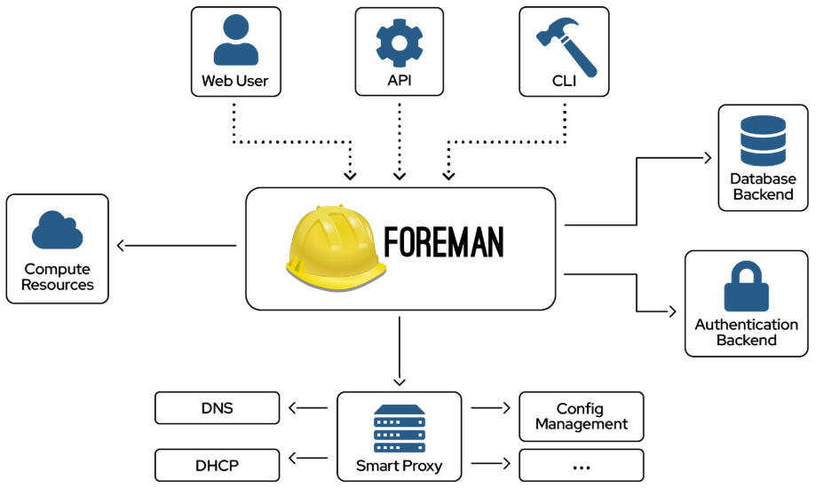

### Requisiti Hardware Minimi

| Componente                          | Minimo | Raccomandato |
| ----------------------------------- | ------ | ------------ |
| CPU                                 | 4 core | 8 core       |
| RAM                                 | 20 GB  | 32 GB        |
| Disco OS                            | 50 GB  | 100 GB       |
| Disco Pulp (`/var/lib/pulp`)        | 100 GB | 300+ GB      |
| Disco PostgreSQL (`/var/lib/pgsql`) | 20 GB  | 50 GB        |
### Architettura Target
### FOREMAN + KATELLO SERVER - (RHEL 9.6)   
##### Componenti:
- Foreman 3.15 
- Katello 4.17
- Puppet 8
- Pulp (Content Management)
- PostgreSQL
- Candlepin
##### Plugin Attivi:
- Remote Execution (SSH)
- Ansible

```
sda                     
 └─/var/lib/pulp
sdb 
 └─/var/lib/pgsql
sdc                     
 └─root
	├─/tmp
	├─/usr
	├─/home
	├─/var
``` 
---
## FASE 1: Verifica e Preparazione del Sistema
### 1.1 Verifica versione OS e SELinux
#### Verifica versione OS
```bash
cat /etc/os-release
```
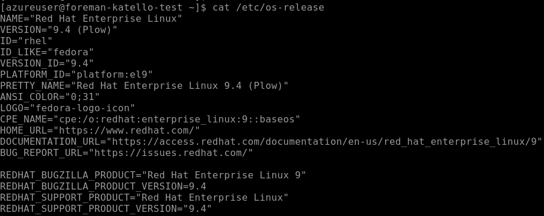

#### Verifica versione SELinux policy
```bash
rpm -q selinux-policy
```

> **IMPORTANTE**: Foreman/Katello 4.17 richiede almeno `selinux-policy >= 38.1.45-3.el9_5`. Se la versione è inferiore (es. `38.1.35-2.el9_4`), è necessario aggiornare il sistema.
### 1.2 Registrazione RHEL e Aggiornamento Sistema
#### Diventa root
```bash
sudo su -
```
#### Registra la sottoscrizione RHEL
```bash
subscription-manager register
```
#### Abilita i repository necessari
```bash
subscription-manager repos --enable=rhel-9-for-x86_64-baseos-rpms
```
```bash
subscription-manager repos --enable=rhel-9-for-x86_64-appstream-rpms
```
#### Aggiorna il sistema a RHEL 9.6
```bash
dnf upgrade --releasever=9.6 -y
```
#### Riavvia per applicare gli aggiornamenti
```bash
reboot
```
### 1.3 Verifica Post-Aggiornamento
#### Verifica che SELinux policy sia aggiornata
```bash
rpm -q selinux-policy
```

Output atteso: `selinux-policy-38.1.53-5.el9_6` o superiore.

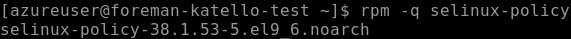

---
## FASE 2: Configurazione NTP con Chrony

La sincronizzazione temporale è **critica** per il corretto funzionamento di Katello e dei certificati SSL.
### 2.1 Installazione e Configurazione Chrony
#### Installa chrony
```bash
sudo su -
```
```bash
dnf install -y chrony
```
#### Abilita e avvia il servizio
```bash
systemctl enable --now chronyd
```
#### Verifica le sorgenti NTP
```bash
chronyc sources
```
#### Abilita NTP via timedatectl
```bash
timedatectl set-ntp true
```
#### Verifica stato sincronizzazione
```bash
timedatectl status
```

Output atteso:

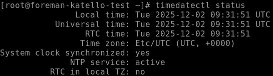

---
## FASE 3: Configurazione Hostname e Networking
### 3.1 Identifica l'interfaccia di rete e l'IP
#### Visualizza interfacce di rete
```bash
ip addr show
```

Annota l'indirizzo IP della tua interfaccia principale (es. `eth0` o `ens192`).
### 3.2 Configura l'hostname
#### Imposta hostname (sostituisci con il tuo FQDN)
```bash
hostnamectl set-hostname foreman-katello-test.localdomain
```
#### Verifica hostname
```bash
hostname
```
```bash
hostname -f
```
### 3.3 Configura il file /etc/hosts
#### Backup del file hosts originale (backup)
```bash
cp /etc/hosts /etc/hosts.bak
```
#### Edita il file hosts
```bash
nano /etc/hosts
```

Aggiungi la seguente riga (sostituisci con i tuoi valori):

```
10.172.2.15    foreman-katello-test.localdomain    foreman-katello-test
```

Il file dovrebbe apparire così:

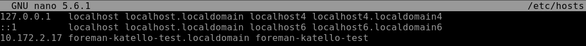
### 3.4 Verifica la configurazione
#### Verifica risoluzione hostname
```bash
ping -c 2 $(hostname -f)
```

---
## FASE 4: Configurazione Firewall
### 4.1 Abilita le porte necessarie
#### Porte TCP per Foreman/Katello
```bash
firewall-cmd --add-port={53,80,443,5646,5647,8000,8140,9090}/tcp --permanent  
```
- 53/tcp   # DNS
- 80/tcp   # HTTP
- 443/tcp # HTTPS
- 5646/tcp # Qpid router
- 5647/tcp # Qpid router
- 8000/tcp # Anaconda
- 8140/tcp # Puppet
- 9090/tcp # Cockpit/Smart Proxy HTTPS
#### Porte UDP
```bash
firewall-cmd --add-port={53,67,68,69}/udp --permanent
```
- 53/udp # DNS
- 67/udp # DHCP
- 68/udp # DHCP
- 69/udp # TFTP
#### Servizi predefiniti
```bash
firewall-cmd --add-service={http,https,dns,dhcp,tftp,puppetmaster} --permanent
```
#### Applica le modifiche
```bash
firewall-cmd --reload
```
### 4.2 Verifica configurazione firewall

```bash
firewall-cmd --list-all
```

Output atteso:

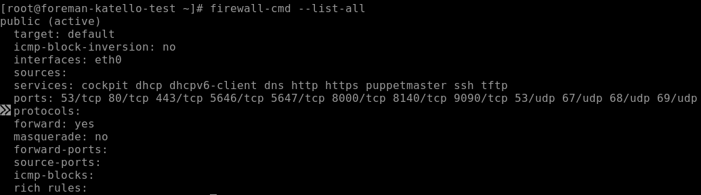

---
## FASE 5: Configurazione Storage LVM per Pulp
Pulp richiede un volume dedicato montato su `/var/lib/pulp` per la gestione dei repository.

### 5.1 Identifica il disco dedicato

```bash
lsblk
```

Identifica il disco aggiuntivo (es. `/dev/sdb` o `/dev/sda` se non è il disco OS).

> **ATTENZIONE**: Assicurati di selezionare il disco corretto! Non formattare il disco del sistema operativo.

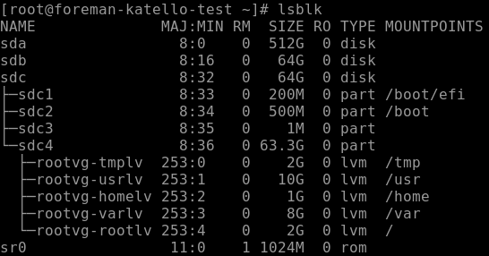
### 5.2 Crea la struttura LVM

#### Crea tabella delle partizioni GPT (sostituisci /dev/sdb con il tuo disco)
```bash
parted /dev/sda --script mklabel gpt
```
#### Crea partizione primaria
```bash
parted /dev/sda --script mkpart primary 0% 100%
```
#### Crea Physical Volume
```bash
pvcreate /dev/sda1
```
#### Crea Volume Group
```bash
vgcreate vg_pulp /dev/sda1
```
#### Crea Logical Volume (usa tutto lo spazio disponibile)
```bash
lvcreate -l 100%FREE -n lv_pulp vg_pulp
```
### 5.3 Formatta e monta il volume
#### Formatta con filesystem XFS (raccomandato per Pulp)
```bash
mkfs.xfs /dev/mapper/vg_pulp-lv_pulp
```
#### Crea directory mount point
```bash
mkdir -p /var/lib/pulp
```
#### Monta il volume
```bash
mount /dev/mapper/vg_pulp-lv_pulp /var/lib/pulp
```
### 5.4 Configura mount persistente
#### Aggiungi entry in fstab per mount automatico al boot
```bash
echo "/dev/mapper/vg_pulp-lv_pulp /var/lib/pulp xfs defaults 0 0" >> /etc/fstab
```
#### Verifica la entry aggiunta
```bash
tail -n1 /etc/fstab
```

### 5.5 Ripristina contesto SELinux
#### Ripristina il contesto SELinux corretto per la directory
```bash
restorecon -Rv /var/lib/pulp/
```
### 5.6 Verifica il mount

```bash
df -hP /var/lib/pulp/
```

Output atteso:

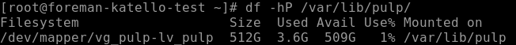

#### Reload systemd per riconoscere le nuove configurazioni
```bash
systemctl daemon-reload
```
## FASE 5-bis : Configurazione Storage LVM per PostgreSQL
Stesso processo, device diverso (es. /dev/sdc)
```bash
parted /dev/sdb --script mklabel gpt
```
```bash
parted /dev/sdb --script mkpart primary 0% 100%
```
```bash
pvcreate /dev/sdb1
```
```bash
vgcreate vg_pgsql /dev/sdb1
```
```bash
lvcreate -l 100%FREE -n lv_pgsql vg_pgsql
```
```bash
mkfs.xfs /dev/mapper/vg_pgsql-lv_pgsql
```
```bash
mkdir -p /var/lib/pgsql
```
```bash
mount /dev/mapper/vg_pgsql-lv_pgsql /var/lib/pgsql
```
```bash
echo "/dev/mapper/vg_pgsql-lv_pgsql /var/lib/pgsql xfs defaults 0 0" >> /etc/fstab
```
```bash
restorecon -Rv /var/lib/pgsql/
```
```bash
df -hP /var/lib/pgsql/
```
```bash
systemctl daemon-reload
```
---
## FASE 6: Installazione Repository
### 6.1 Abilita CodeReady Builder e EPEL
#### Abilita CodeReady Linux Builder
```bash
subscription-manager repos --enable codeready-builder-for-rhel-9-$(arch)-rpms
```
#### Installa EPEL per RHEL 9
```bash
dnf install -y https://dl.fedoraproject.org/pub/epel/epel-release-latest-9.noarch.rpm
```
#### Abilita EPEL
```bash
dnf config-manager --set-enabled epel
```

### 6.2 Pulisci e aggiorna cache
Ora possiamo iniziare con l'installazione dei Foreman-Katello. Seguima dunque quanto riporato dalla guida per instllare verione di Foreman 3.15 Katello 4.17 e Puppet 8 https://docs.theforeman.org/3.15/Quickstart/index-katello.html
#### Pulisci tutti i metadati
```bash
dnf clean all
```
#### Aggiorna cache repository
```bash
dnf makecache
```
### 6.3 Installa repository Foreman, Katello e Puppet
#### Repository Foreman 3.15
```bash
dnf install -y https://yum.theforeman.org/releases/3.15/el9/x86_64/foreman-release.rpm
```
#### Repository Katello 4.17
```bash
dnf install -y https://yum.theforeman.org/katello/4.17/katello/el9/x86_64/katello-repos-latest.rpm
```
#### Repository Puppet 8
```bash
dnf install -y https://yum.puppet.com/puppet8-release-el-9.noarch.rpm
```
### 6.4 Verifica i repository abilitati

```bash
dnf repolist enabled
```

Output atteso:

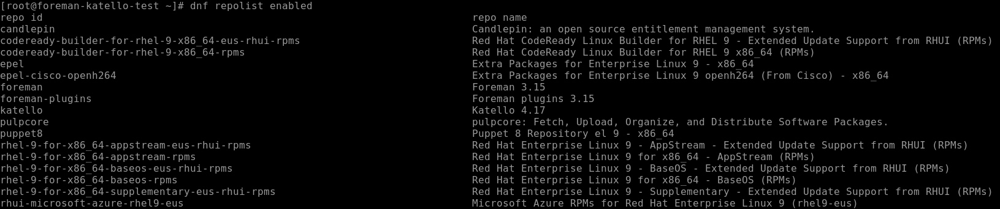

---
## FASE 7: Installazione Foreman-Katello
### 7.1 Aggiorna il sistema
#### Aggiorna tutti i pacchetti prima dell'installazione
```bash
dnf upgrade -y
```
### 7.2 Installa il pacchetto installer
#### Installa foreman-installer per scenario Katello
```bash
dnf install -y foreman-installer-katello
```

### 7.3 Esegui l'installazione con plugin
Questa è l'installazione completa con tutti i plugin necessari per gestire VM Ubuntu via SSH:

```bash
foreman-installer --scenario katello \
  --foreman-initial-admin-username admin \
  --foreman-initial-admin-password 'Temporanea1234' \
  --enable-foreman-plugin-remote-execution \
  --enable-foreman-proxy-plugin-remote-execution-script \
  --enable-foreman-plugin-ansible \
  --enable-foreman-proxy-plugin-ansible \
  --enable-foreman-plugin-templates \
  --enable-foreman-cli-katello
```

> **NOTA**: L'installazione richiede 15-30 minuti. Non interrompere il processo.

#### Opzioni installer spiegate:

| Opzione                                                 | Descrizione                                         |
| ------------------------------------------------------- | --------------------------------------------------- |
| `--scenario katello`                                    | Installa Foreman con Katello per content management |
| `--foreman-initial-admin-username`                      | Username admin iniziale                             |
| `--foreman-initial-admin-password`                      | Password admin iniziale                             |
| `--enable-foreman-plugin-remote-execution`              | Abilita esecuzione comandi remoti via SSH           |
| `--enable-foreman-proxy-plugin-remote-execution-script` | Proxy per remote execution                          |
| `--enable-foreman-plugin-ansible`                       | Integrazione Ansible                                |
| `--enable-foreman-proxy-plugin-ansible`                 | Proxy per Ansible                                   |
| `--enable-foreman-plugin-templates`                     | Gestione template                                   |
| `--enable-foreman-cli-katello`                          | CLI hammer per Katello                              |

### 7.4 Monitora l'installazione (opzionale)
In un altro terminale puoi monitorare il log:

```bash
tail -f /var/log/foreman-installer/katello.log
```

### 7.5 Output installazione completata
Al termine dell'installazione vedrai un output simile:

![[image13-v2.png]]

---
## FASE 8: Verifica dell'Installazione
### 8.1 Verifica stato servizi
#### Verifica stato di tutti i servizi Katello
```bash
foreman-maintain service status
```

Oppure:

#### Verifica servizi singoli
```bash
systemctl status foreman
systemctl status httpd
systemctl status postgresql
systemctl status pulpcore-api
systemctl status pulpcore-content
```

### 8.2 Verifica accesso web

Apri un browser e accedi a:

- **URL**: `https://foreman-katello.localdomain` (o l'IP del server: `https://10.172.2.15`)
- **Username**: `admin`
- **Password**: `Temporanea1234` (o quella specificata durante l'installazione)

> **NOTA**: Se il browser mostra un avviso certificato, è normale (certificato self-signed). Procedi accettando il rischio.

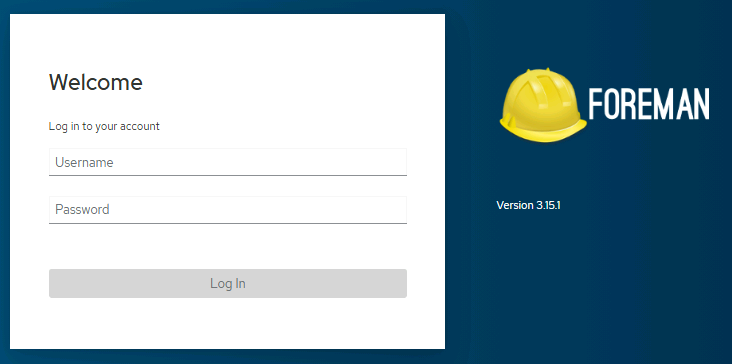
### 8.3 Recupera credenziali (se necessario)
Se hai dimenticato la password:

```bash
grep admin_password /etc/foreman-installer/scenarios.d/katello-answers.yaml
```
### 8.4 Test CLI Hammer
#### Login con hammer
```bash
hammer auth login basic --username admin --password 'Temporanea1234'
```
#### Verifica utenti
```bash
hammer user list
```
#### Verifica organizzazioni
```bash
hammer organization list
```
#### Verifica locations
```bash
hammer location list
```
### 8.5 Verificare i plugin attivi
#### Via RPM
```bash
rpm -qa | grep -E "rubygem-foreman_|foreman-plugin"
```

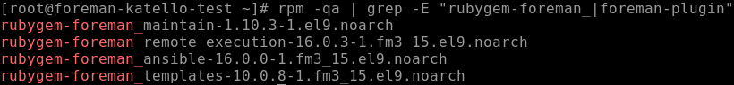

#### Via Web UI
##### Administer → About → Scorri fino a "Plugins" e vedrai la lista completa con versioni.


---
### Ambiente di Riferimento

| Componente       | Valore                           |
| ---------------- | -------------------------------- |
| Server Foreman   | foreman-katello-test.localdomain |
| Organization     | PSN-ASL06                        |
| Location         | Italy-North                      |
| VM Ubuntu Target | 10.172.2.5                       |
| OS Target        | Ubuntu 24.04 LTS                 |
## FASE 9: Configurazione Post-Installazione
### 9.1 Configura Organization e Location
#### L'organizzazione di default è già creata, ma puoi crearne altre
```bash
hammer organization create --name "PSN-ASL06" --label "myorg"
```
#### Crea location per il tuo ambiente Azure
```bash
hammer location create --name "Italy-North"
```
#### Associa location all'organizzazione
```bash
hammer organization add-location --name "PSN-ASL06" --location "Italy-North"
```
### 9.2 Verifica plugin Remote Execution
#### Verifica che il plugin REX sia attivo
```bash
hammer settings list | grep remote_execution
```

Le impostazioni chiave sono:

| Setting                                  | Valore                           | Significato               |
| ---------------------------------------- | -------------------------------- | ------------------------- |
| `remote_execution_ssh_user`              | **root**                         | Connessione SSH come root |
| `remote_execution_ssh_port`              | **22**                           | Porta standard SSH        |
| `remote_execution_effective_user`        | **root**                         | Esegue comandi come root  |
| `remote_execution_effective_user_method` | **sudo**                         | Usa sudo se necessario    |
| `remote_execution_global_proxy`          | **true**                         | Cerca proxy disponibili   |
| `remote_execution_form_job_template`     | **Run Command - Script Default** | Template default pronto   |
#### Verifica la chiave SSH di Foreman
```bash
cat /var/lib/foreman-proxy/ssh/id_rsa_foreman_proxy.pub
```

> **IMPORTANTE**: Questa chiave pubblica dovrà essere copiata sulle VM Ubuntu chesi vogliono gestire.

### 9.3 Verifica Smart Proxy esistente
#### Lista gli Smart Proxy disponibili
```bash
hammer proxy list
```
Output atteso:


### 9.4 Associa Smart Proxy all'Organization e alla Location
#### Associa il proxy all'organizzazione PSN-ASL06
```bash
hammer organization add-smart-proxy \
  --name "PSN-ASL06" \
  --smart-proxy "foreman-katello-test.localdomain"
```
#### Associa il proxy alla location Italy-North
```bash
hammer location add-smart-proxy \
  --name "Italy-North" \
  --smart-proxy "foreman-katello-test.localdomain"
```
### 9.5 Verifica associazioni
#### Verifica Organization
```bash
hammer organization info --name "PSN-ASL06"
```

#### Verifica dalla Web UI andando **Infrastructure → Smart Proxies**

![[image-4.png]]

1. Vai su **Administer → Organizations → PSN-ASL06 → Smart Proxies**
2. Verifica che `foreman-katello-test.localdomain` sia presente
3. Ripeti per **Administer → Locations → Italy-North → Smart Proxies**

---
## FASE 10: Configurazione Content Credentials (Chiavi GPG)
Le chiavi GPG sono necessarie per verificare l'autenticità dei pacchetti Ubuntu.
### 10.1 Scarica le chiavi GPG di Ubuntu
#### Crea directory se non esiste
```bash
mkdir -p /etc/pki/rpm-gpg/import
```
#### Scarica Ubuntu Archive Keyring
```bash
curl -o /etc/pki/rpm-gpg/import/ubuntu-archive-keyring.gpg \
  "http://archive.ubuntu.com/ubuntu/project/ubuntu-archive-keyring.gpg"
```
#### Scarica Ubuntu Archive Signing Key (2018)
```bash
curl -o /etc/pki/rpm-gpg/import/ubuntu-archive-key-2018.asc \
  "https://keyserver.ubuntu.com/pks/lookup?op=get&search=0x871920D1991BC93C"
```
### 10.2 Estrai le chiavi in formato ASCII
#### Converti il keyring in formato ASCII per l'import in Foreman
```bash
gpg --no-default-keyring \
  --keyring /etc/pki/rpm-gpg/import/ubuntu-archive-keyring.gpg \
  --export --armor > /etc/pki/rpm-gpg/import/ubuntu-keys-ascii.asc
```
### 10.3 Crea Content Credential in Foreman
**Via Web UI (raccomandato):**
1. Vai su **Content → Content Credentials**
2. Clicca **Create Content Credential**
3. Compila:
    - **Name**: `Ubuntu Archive Key`
    - **Content Credential Type**: `GPG Key`
    - **Content Credential Contents**: Copia il contenuto del file:

```bash
cat /etc/pki/rpm-gpg/import/ubuntu-keys-ascii.asc
```
4. Clicca **Save**

**Via CLI:**
```bash
hammer content-credentials create \
  --organization "PSN-ASL06" \
  --name "Ubuntu Archive Key" \
  --content-type "gpg_key" \
  --path "/etc/pki/rpm-gpg/import/ubuntu-keys-ascii.asc"
```

---
## FASE 11: Creazione Product e Repository Ubuntu 24.04
### 11.1 Crea il Product
#### Via Web UI

1. Vai su **Content → Products**
2. Clicca **Create Product**
3. Compila:
    - **Name**: `Ubuntu 24.04 LTS`
    - **Label**: `ubuntu_2404_lts` (auto-generato)
    - **GPG Key**: lascia vuoto (lo assegniamo ai singoli repository)
    - **Description**: `Repository Ubuntu 24.04 Noble Numbat per patch management - TEST`
4. Clicca **Save**

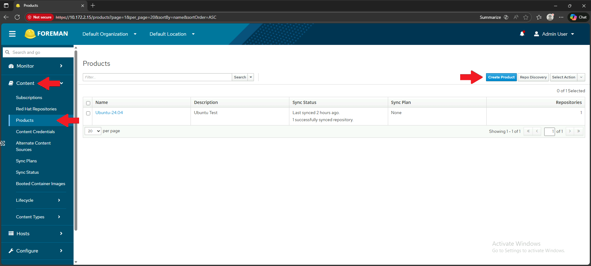
#### Via Hammer CLI

```bash
hammer product create \
  --organization "PSN-ASL06" \
  --name "Ubuntu 24.04 LTS" \
  --label "ubuntu_2404_lts" \
  --description "Repository Ubuntu 24.04 Noble Numbat per patch management"
```
### 11.2 Crea Repository Security
#### Via Web UI

1. Vai su **Content → Products → Ubuntu 24.04 LTS**
2. Clicca tab **Repositories** → **New Repository**
3. Compila:
    - **Name**: `Ubuntu 24.04 Security`
    - **Label**: `ubuntu_24_04_security`
    - **Description**: `TEST`
    - **Type**: `deb`
    - **URL**: `http://security.ubuntu.com/ubuntu`
    - **Releases**: `noble-security`
    - **Components**: `main universe restricted multiverse`
    - **Architectures**: `amd64`
    - **GPG Key**: `Ubuntu Archive Key` (creato in FASE 10)
    - **Download Policy**: `On Demand`
4. Clicca **Save**


| Versione Ubuntu  | Codename            |
| ---------------- | ------------------- |
| Ubuntu 20.04 LTS | **Focal** Fossa     |
| Ubuntu 22.04 LTS | **Jammy** Jellyfish |
| Ubuntu 24.04 LTS | **Noble** Numbat    |
#### Via Hammer CLI

```bash
hammer repository create \
  --organization "PSN-ASL06" \
  --product "Ubuntu 24.04 LTS" \
  --name "Ubuntu 24.04 Security" \
  --label "ubuntu_2404_security" \
  --content-type "deb" \
  --url "http://security.ubuntu.com/ubuntu" \
  --deb-releases "noble-security" \
  --deb-components "main,universe,restricted,multiverse" \
  --deb-architectures "amd64" \
  --download-policy "on_demand" \
  --gpg-key "Ubuntu Archive Key"
```
### 11.3 Crea Repository Updates
#### Via Web UI

1. In **Content → Products → Ubuntu 24.04 LTS → Repositories**
2. Clicca **New Repository**
3. Compila: (Riporto unicamente i campi che subiscono una modifica)
    - **Name**: `Ubuntu 24.04 Updates`
    - **Label**: `ubuntu_2404_updates`
    - **URL**: `http://archive.ubuntu.com/ubuntu`
    - **Releases**: `noble-updates`
4. Clicca **Save**
### 11.4 Crea Repository Base
#### Via Web UI

1. In **Content → Products → Ubuntu 24.04 LTS → Repositories**
2. Clicca **New Repository**
3. Compila:
    - **Name**: `Ubuntu 24.04 Base`
    - **Label**: `ubuntu_2404_base`
    - **URL**: `http://archive.ubuntu.com/ubuntu`
    - **Releases**: `noble`
    - **Components**: `main universe restricted multiverse`
4. Clicca **Save
### 11.5 Verifica Repository Creati
#### Via Web UI

1. Vai su **Content → Products → Ubuntu 24.04 LTS → Repositories**
2. Dovresti vedere 3 repository elencati
#### Via Hammer CLI

```bash
hammer repository list --organization "PSN-ASL06" --product "Ubuntu 24.04 LTS"
```

---
## FASE 12: Sincronizzazione Repository
### 12.1 Sincronizza Tutti i Repository
#### Via Web UI

1. Vai su **Content → Products → Ubuntu 24.04 LTS**
2. Seleziona tutti i repository (checkbox)
3. Clicca **Sync Now**

Oppure:

1. Vai su **Content → Sync Status**
2. Espandi **Ubuntu 24.04 LTS**
3. Seleziona i repository da sincronizzare
4. Clicca **Synchronize Now**

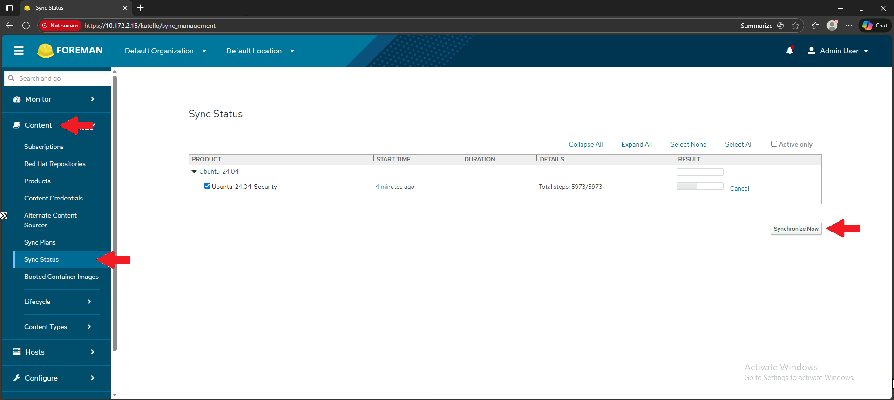
#### Via Hammer CLI
##### Sync di tutto il product
```bash
hammer product synchronize \
  --organization "PSN-ASL06" \
  --name "Ubuntu 24.04 LTS" \
  --async
```

Oppure singolarmente:
##### e.g. Sync Security
```bash
hammer repository synchronize \
  --organization "PSN-ASL06" \
  --product "Ubuntu 24.04 LTS" \
  --name "Ubuntu 24.04 Security" \
  --async
```
### 12.2 Monitora Sincronizzazione
#### Via Web UI

1. Vai su **Content → Sync Status**
2. Visualizza lo stato in tempo reale per ogni repository

Oppure:

1. Vai su **Monitor → Tasks**
2. Filtra per `state = running`
#### Via Hammer CLI

```bash
# Lista task in esecuzione
hammer task list --search "state=running"

# Dettaglio task specifico
hammer task progress --id <TASK_ID>
```
### 12.3 Crea Sync Plan (Sincronizzazione Automatica) - NON FATTO AL MOMENTO

#### Via Web UI

1. Vai su **Content → Sync Plans**
2. Clicca **Create Sync Plan**
3. Compila:
    - **Name**: `Daily-Ubuntu-Sync`
    - **Description**: `Sincronizzazione giornaliera repository Ubuntu`
    - **Interval**: `daily`
    - **Start Date**: seleziona data
    - **Start Time**: `02:00` (orario notturno)
4. Clicca **Save**
5. Nella pagina del Sync Plan, vai tab **Products**
6. Clicca **Add** → seleziona **Ubuntu 24.04 LTS** → **Add Selected**
#### Via Hammer CLI

```bash
# Crea sync plan
hammer sync-plan create \
  --organization "PSN-ASL06" \
  --name "Daily-Ubuntu-Sync" \
  --description "Sincronizzazione giornaliera repository Ubuntu" \
  --enabled true \
  --interval "daily" \
  --sync-date "2025-01-01 02:00:00"

# Associa product al sync plan
hammer product set-sync-plan \
  --organization "PSN-ASL06" \
  --name "Ubuntu 24.04 LTS" \
  --sync-plan "Daily-Ubuntu-Sync"
```

---
## FASE 13: Lifecycle Environments
### 13.1 Crea Ambiente Development
#### Via Web UI

1. Vai su **Content → Lifecycle → Lifecycle Environments**
2. Clicca **Create Environment Path**
3. Compila:
    - **Name**: `Development`
    - **Label**: `development`
    - **Description**: `Ambiente di sviluppo e test`
4. Clicca **Save**

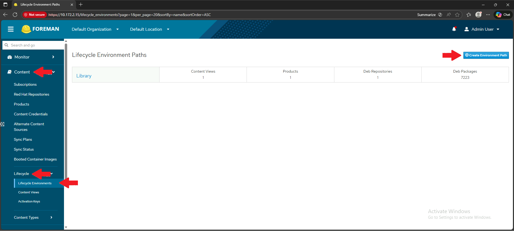
#### Via Hammer CLI

```bash
hammer lifecycle-environment create \
  --organization "PSN-ASL06" \
  --name "Development" \
  --label "development" \
  --prior "Library" \
  --description "Ambiente di sviluppo e test"
```
### 13.2 Aggiungi Ambiente Test
#### Via Web UI

1. In **Lifecycle Environments**, clicca su **Add New Environment** dopo "Test"
2. Compila:
    - **Name**: `Test`
    - **Label**: `test`
    - **Description**: `Ambiente di test pre-produzione`
3. Clicca **Save**

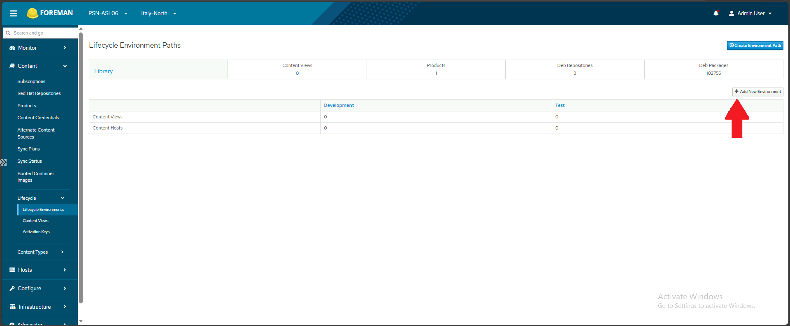
#### Via Hammer CLI

```bash
hammer lifecycle-environment create \
  --organization "PSN-ASL06" \
  --name "Test" \
  --label "test" \
  --prior "Development" \
  --description "Ambiente di staging pre-produzione"
```
### 13.3 Aggiungi Ambiente Production
#### Via Web UI

1. In **Lifecycle Environments**, clicca su **Add New Environment** dopo "Staging"
2. Compila:
    - **Name**: `Production`
    - **Label**: `production`
    - **Description**: `Ambiente di produzione`
3. Clicca **Save**
### 13.4 Verifica Lifecycle Path
#### Via Web UI

Vai su **Content → Lifecycle → Lifecycle Environments**
#### Via Hammer CLI

```bash
hammer lifecycle-environment paths --organization "PSN-ASL06"
```
Output atteso :

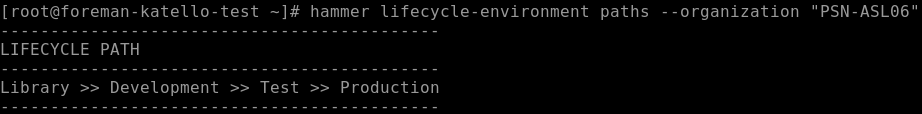

---
## FASE 14: Content View
### 14.1 Crea Content View
#### Via Web UI

1. Vai su **Content → Lifecycle → Content Views**
2. Clicca **Create Content View**
3. Compila:
    - **Name**: `CV-Ubuntu-2404`
    - **Label**: `cv_ubuntu_2404`
    - **Description**: `Content View per Ubuntu 24.04 LTS`
    - **Type**: `Content View` (non Composite)
4. Clicca **Create Content View**

> NOTA SUL FLAG : Solve Dependencies
### ==Solve Dependencies==
Il flag **"Solve dependencies"** serve a risolvere automaticamente le dipendenze dei pacchetti quando pubblichi la Content View.
#### Cosa fa

| Stato              | Comportamento                                                            |
| ------------------ | ------------------------------------------------------------------------ |
| ☐ **Disabilitato** | Include solo i pacchetti esplicitamente presenti nei repository aggiunti |
| ☑ **Abilitato**    | Include automaticamente anche tutti i pacchetti dipendenza necessari     |
#### Esempio pratico
Se vuoi installare `nginx` che dipende da `libssl`, `libpcre`, ecc:
- **Senza Solve Dependencies**: potresti avere `nginx` ma non le sue dipendenze → installazione fallisce
- **Con Solve Dependencies**: Katello include automaticamente tutte le dipendenze → installazione OK
#### Quando usarlo

| Scenario | Raccomandazione |
|----------|-----------------|
| Repository completi (mirror full) | ☐ Non necessario |
| Repository filtrati (solo alcuni pacchetti) | ☑ **Raccomandato** |
| Content View con filtri specifici | ☑ **Raccomandato** |
In Questa fase di TEST verrà lasciata vuota **in futuro con l'applicazione di filtri sarà necessaria**.

#### Crea Content View via Hammer CLI
```bash
hammer content-view create \
  --organization "PSN-ASL06" \
  --name "CV-Ubuntu-2404" \
  --label "cv_ubuntu_2404" \
  --description "Content View per Ubuntu 24.04 LTS"
```
### 14.2 Aggiungi Repository alla Content View
#### Via Web UI

1. In **Content Views → CV-Ubuntu-2404**
2. Vai tab **Repositories**
3. Clicca **Add Repositories** or **Show repositories**
4. Seleziona tutti e 3 i repository:
    - ☑ Ubuntu 24.04 Security
    - ☑ Ubuntu 24.04 Updates
    - ☑ Ubuntu 24.04 Base
5. Clicca **Add Repositories**

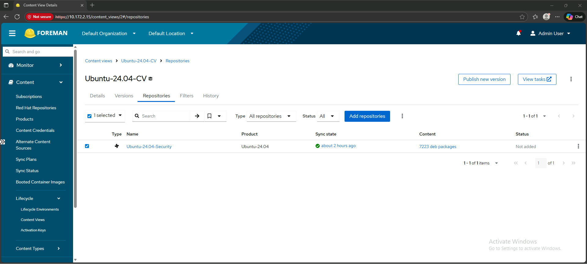
#### Via Hammer CLI

```bash
# Aggiungi Security
hammer content-view add-repository \
  --organization "PSN-ASL06" \
  --name "CV-Ubuntu-2404" \
  --product "Ubuntu 24.04 LTS" \
  --repository "Ubuntu 24.04 Security"

# Aggiungi Updates
hammer content-view add-repository \
  --organization "PSN-ASL06" \
  --name "CV-Ubuntu-2404" \
  --product "Ubuntu 24.04 LTS" \
  --repository "Ubuntu 24.04 Updates"

# Aggiungi Base
hammer content-view add-repository \
  --organization "PSN-ASL06" \
  --name "CV-Ubuntu-2404" \
  --product "Ubuntu 24.04 LTS" \
  --repository "Ubuntu 24.04 Base"
```
### 14.3 Pubblica Content View
#### Via Web UI

1. In **Content Views → CV-Ubuntu-2404**
2. Clicca **Publish New Version**
3. Compila:
    - **Description**: `Initial publish`
4. Clicca **Publish**
5. Attendi il completamento

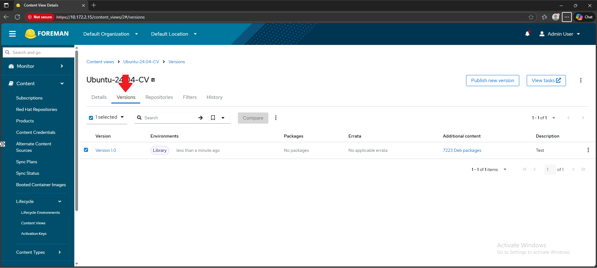
#### Via Hammer CLI

```bash
hammer content-view publish \
  --organization "PSN-ASL06" \
  --name "CV-Ubuntu-2404" \
  --description "Initial publish"
```
### 14.4 Promuovi Content View a Development
#### Via Web UI

1. In **Content Views → CV-Ubuntu-2404 → Versions**
2. Trova la versione 1.0
3. Clicca sul menu **⋮** → **Promote**
4. Seleziona ☑ **Development**
5. Clicca **Promote**

Ripeti il processo di promozione per ogni ambiente:

6. **Versions → ⋮ → Promote → Staging → Promote**
7. **Versions → ⋮ → Promote → Production → Promote**


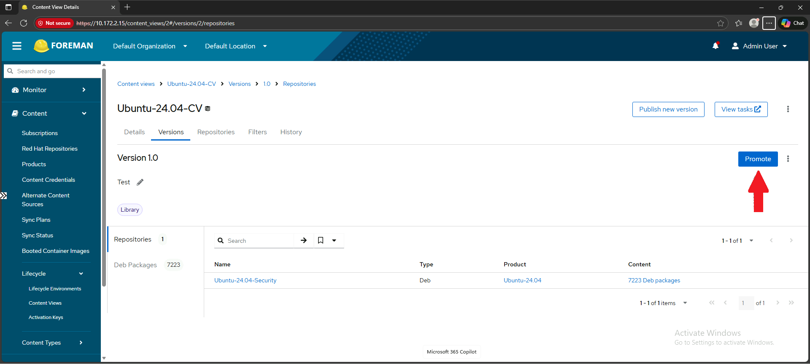

#### Via Hammer CLI

```bash
hammer content-view version promote \
  --organization "PSN-ASL06" \
  --content-view "CV-Ubuntu-2404" \
  --to-lifecycle-environment "Development"
```
### 14.5 Verifica Content View
#### Via Web UI
In **Content Views → CV-Ubuntu-2404 → Versions** dovresti vedere la versione presente in tutti gli ambienti.

#### Via Hammer CLI

```bash
hammer content-view info \
  --organization "PSN-ASL06" \
  --name "CV-Ubuntu-2404"
```

---
## FASE 15: Operating System
### 15.1 Verifica OS Esistenti
#### Via Web UI

1. Vai su **Hosts → Provisioning Setup → Operating Systems**
2. Cerca se esiste già "Ubuntu 24.04"

#### Via Hammer CLI

```bash
hammer os list | grep -i ubuntu
```
### 15.2 Crea Operating System (se non esiste)
#### Via Web UI

1. Vai su **Hosts → Provisioning Setup → Operating Systems**
2. Clicca **Create Operating System**
3. Compila:
    - **Name**: `Ubuntu`
    - **Major Version**: `24`
    - **Minor Version**: `04`
    - **Family**: `Debian`
    - **Release Name**: `noble`
4. Tab **Architectures**: seleziona ☑ `x86_64`
5. Clicca **Submit**

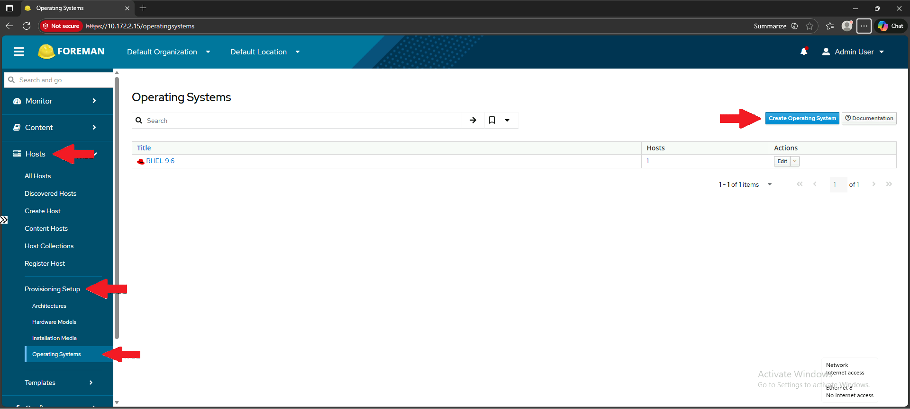
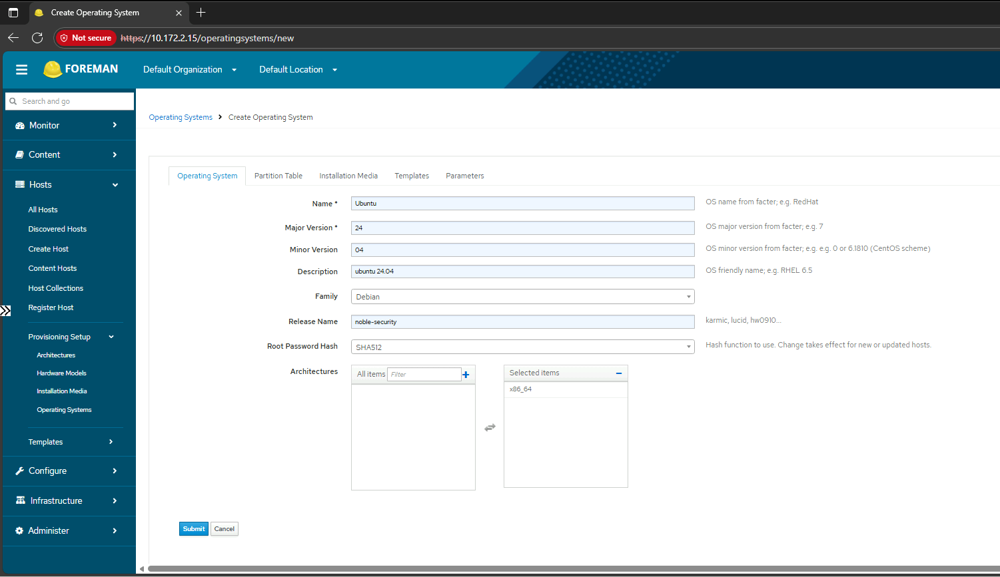

#### Via Hammer CLI

```bash
# Crea OS
hammer os create \
  --name "Ubuntu" \
  --major "24" \
  --minor "04" \
  --family "Debian" \
  --release-name "noble" \
  --description "Ubuntu 24.04 LTS Noble Numbat"

# Associa architecture
hammer os add-architecture \
  --title "Ubuntu 24.04" \
  --architecture "x86_64"
```
### 15.3 Verifica Operating System
#### Via Web UI

In **Operating Systems** dovresti vedere `Ubuntu 24.04`

#### Via Hammer CLI

```bash
hammer os info --title "Ubuntu 24.04"
```

---
## FASE 16: Host Group

> NOTA : **Differenza TRA** Host Groups e Host Collections

|Concetto|Posizione|Scopo|
|---|---|---|
|**Host Groups**|**Configure → Host Groups**|Configurazioni comuni (OS, Content View, Lifecycle, parametri)|
|**Host Collections**|Hosts → Host Collections|Raggruppamento per azioni bulk (errata, pacchetti)|
#### Quando usare Host Collections?
Le Host Collections sono utili **dopo** aver registrato gli host, per:

- Applicare errata a gruppi di host
- Installare/rimuovere pacchetti in bulk
- Azioni di content management
### 16.1 Crea Host Group
#### Via Web UI

1. Vai su **Configure → Host Groups**
2. Clicca **Create Host Group**
3. Tab **Host Group**:
    - **Name**: `Ubuntu-2404-Groups`
    - **Description**: `Groups Ubuntu 24.04 LTS`
    - **Lifecycle Environment**: `Production`
    - **Content View**: `CV-Ubuntu-2404`
    - **Content Source**: `foreman-katello-test.localdomain`
4. Tab **Operating System**:
    - **Operating System**: `Ubuntu 24.04`
    - **Architecture**: `x86_64`
5. Tab **Locations**: seleziona ☑ `Italy-North`
6. Tab **Organizations**: seleziona ☑ `PSN-ASL06`
7. Clicca **Submit**

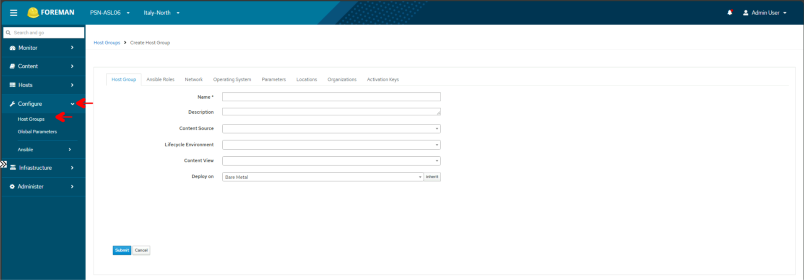
#### Via Hammer CLI

```bash
hammer hostgroup create \
  --organization "PSN-ASL06" \
  --location "Italy-North" \
  --name "Ubuntu-2404-Servers" \
  --description "Server Ubuntu 24.04 LTS" \
  --lifecycle-environment "Production" \
  --content-view "CV-Ubuntu-2404" \
  --content-source "foreman-katello-test.localdomain" \
  --operatingsystem "Ubuntu 24.04"
```
### 16.2 Configura Parametri SSH per Host Group
#### Via Web UI

1. In **Host Groups → Ubuntu-2404-Servers**
2. Vai tab **Parameters**
3. Clicca **Add Parameter**:
    - **Name**: `remote_execution_ssh_user`
    - **Type**: `string`
    - **Value**: `root`
4. Clicca **Add Parameter**:
    - **Name**: `remote_execution_connect_by_ip`
    - **Type**: `boolean`
    - **Value**: `true`
5. Clicca **Submit**
#### Via Hammer CLI

```bash
# Utente SSH
hammer hostgroup set-parameter \
  --hostgroup "Ubuntu-2404-Servers" \
  --name "remote_execution_ssh_user" \
  --parameter-type "string" \
  --value "root"

# Connessione via IP
hammer hostgroup set-parameter \
  --hostgroup "Ubuntu-2404-Servers" \
  --name "remote_execution_connect_by_ip" \
  --parameter-type "boolean" \
  --value "true"
```

---
## FASE 17: Activation Key
### 17.1 Crea Activation Key
#### Via Web UI

1. Vai su **Content → Lifecycle → Activation Keys**
2. Clicca **Create Activation Key**
3. Compila:
    - **Name**: `ak-ubuntu-2404-prod`
    - **Description**: `Activation Key per Ubuntu 24.04 Production`
    - **Environment**: `Production`
    - **Content View**: `CV-Ubuntu-2404`
    - **Unlimited Hosts**: ☑ abilitato
4. Clicca **Save**

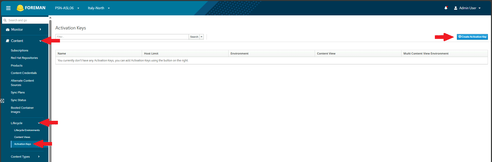

#### Via Hammer CLI

```bash
hammer activation-key create \
  --organization "PSN-ASL06" \
  --name "ak-ubuntu-2404-prod" \
  --description "Activation Key per Ubuntu 24.04 Production" \
  --lifecycle-environment "Production" \
  --content-view "CV-Ubuntu-2404" \
  --unlimited-hosts
```
### 17.2 Verifica Activation Key
#### Via Web UI

In **Activation Keys** dovresti vedere `ak-ubuntu-2404-prod`

#### Via Hammer CLI

```bash
hammer activation-key info \
  --organization "PSN-ASL06" \
  --name "ak-ubuntu-2404-prod"
```

---
## FASE 18: Preparazione VM Ubuntu (10.172.2.5)
Questa fase richiede accesso alla VM Ubuntu target in questo caso `test-Lorenzo-1` vedere [ASL0603](../Utenze/ASL0603.md) per le Utenze
### 18.1 Ottieni la Chiave SSH di Foreman

#### Sul Server Foreman

```bash
cat /var/lib/foreman-proxy/ssh/id_rsa_foreman_proxy.pub
```

Copia l'output (inizia con `ssh-rsa ...`)
### 18.2 Configura SSH sulla VM Ubuntu
#### Sulla VM Ubuntu (10.172.2.5)
Connettiti alla VM con le credenziali attuali
```bash
sudo su -
```
Crea directory .ssh se non esiste
```bash
mkdir -p /root/.ssh
```
```bash
chmod 700 /root/.ssh
```
Aggiungi la chiave pubblica di Foreman
```bash
nano /root/.ssh/authorized_keys
```
Incolla la chiave pubblica copiata prima e salva.

Imposta permessi corretti
```bash
chmod 600 /root/.ssh/authorized_keys
```
```bash
chown root:root /root/.ssh/authorized_keys
```
### 18.3 Configura SSHD
Edita configurazione SSH
```bash
nano /etc/ssh/sshd_config
```

Verifica/modifica queste righe:

```
PermitRootLogin prohibit-password
PubkeyAuthentication yes
```
Riavvia SSH
```bash
sudo systemctl restart ssh
```
### 18.4 Test Connessione SSH
#### Sul Server Foreman

```bash
ssh -i /var/lib/foreman-proxy/ssh/id_rsa_foreman_proxy root@10.172.2.5 "hostname && uptime"
```

Se vedi hostname e uptime della VM, la connessione funziona! ✅

## FASE 10: Configurazione Repository per Ubuntu

Per gestire VM Ubuntu, devi configurare i repository DEB.

### 10.1 Crea Product per Ubuntu

```bash
# Crea il Product
hammer product create \
  --organization "MyOrganization" \
  --name "Ubuntu 22.04 LTS" \
  --description "Repository Ubuntu 22.04 Jammy"
```

### 10.2 Crea Repository Ubuntu

```bash
# Repository Main
hammer repository create \
  --organization "MyOrganization" \
  --product "Ubuntu 22.04 LTS" \
  --name "Ubuntu 22.04 Main" \
  --content-type "deb" \
  --url "http://archive.ubuntu.com/ubuntu" \
  --deb-releases "jammy,jammy-updates,jammy-security" \
  --deb-components "main,universe" \
  --deb-architectures "amd64" \
  --download-policy "on_demand"
```

### 10.3 Sincronizza il repository

```bash
# Avvia sincronizzazione (può richiedere tempo)
hammer repository synchronize \
  --organization "MyOrganization" \
  --product "Ubuntu 22.04 LTS" \
  --name "Ubuntu 22.04 Main" \
  --async
```

```bash
# Monitora lo stato della sincronizzazione
hammer task list --search "state=running"
```

---

## FASE 11: Configurazione Content View e Lifecycle

### 11.1 Crea Content View

```bash
hammer content-view create \
  --organization "MyOrganization" \
  --name "CV-Ubuntu-Base" \
  --description "Content View per Ubuntu 22.04"
```

### 11.2 Aggiungi repository alla Content View

```bash
hammer content-view add-repository \
  --organization "MyOrganization" \
  --name "CV-Ubuntu-Base" \
  --product "Ubuntu 22.04 LTS" \
  --repository "Ubuntu 22.04 Main"
```

### 11.3 Pubblica la Content View

```bash
hammer content-view publish \
  --organization "MyOrganization" \
  --name "CV-Ubuntu-Base" \
  --description "Initial publish"
```

### 11.4 Crea Lifecycle Environment

```bash
# Crea ambiente Development
hammer lifecycle-environment create \
  --organization "MyOrganization" \
  --name "Development" \
  --prior "Library"
```

```bash
# Crea ambiente Production
hammer lifecycle-environment create \
  --organization "MyOrganization" \
  --name "Production" \
  --prior "Development"
```

### 11.5 Promuovi Content View

```bash
# Promuovi a Development
hammer content-view version promote \
  --organization "MyOrganization" \
  --content-view "CV-Ubuntu-Base" \
  --to-lifecycle-environment "Development"
```

---

## FASE 12: Crea Activation Key

L'Activation Key serve per registrare automaticamente gli host.

```bash
hammer activation-key create \
  --organization "MyOrganization" \
  --name "ak-ubuntu-dev" \
  --lifecycle-environment "Development" \
  --content-view "CV-Ubuntu-Base" \
  --unlimited-hosts
```

---

## Troubleshooting

### Problema: Installazione fallita

```bash
# Visualizza log completo
cat /var/log/foreman-installer/katello.log

# Riesegui installer (è idempotente)
foreman-installer --scenario katello
```

### Problema: Servizi non partono

```bash
# Restart di tutti i servizi
foreman-maintain service restart
```

### Problema: Errori SELinux

```bash
# Verifica problemi SELinux
ausearch -m avc -ts recent

# Genera policy fix
audit2allow -a -M foreman_fix
semodule -i foreman_fix.pp
```

### Problema: Spazio disco insufficiente

```bash
# Verifica spazio
df -h

# Pulisci cache Pulp se necessario
foreman-rake katello:delete_orphaned_content RAILS_ENV=production
```

### Problema: Connessione firewall

```bash
# Test connettività porte
ss -tulpn | grep -E '(443|5647|9090)'
```

---

## Riepilogo Comandi Utili

```bash
# Stato servizi
foreman-maintain service status

# Restart servizi
foreman-maintain service restart

# Verifica salute sistema
foreman-maintain health check

# Backup
foreman-maintain backup offline /backup/foreman

# Aggiornamento Foreman
foreman-maintain upgrade check
foreman-maintain upgrade run
```

---

## Prossimi Passi

Una volta completata l'installazione, i prossimi passi saranno:

1. **Registrare la VM Ubuntu** al server Foreman
2. **Configurare Remote Execution** per la gestione via SSH
3. **Schedulare patch automatiche** tramite Foreman
4. **Configurare Errata Management** per le security patch

---

## Riferimenti

- [Documentazione ufficiale Foreman 3.15](https://docs.theforeman.org/3.15/)
- [Documentazione Katello](https://docs.theforeman.org/3.15/Quickstart/index-katello.html)
- [Foreman Remote Execution](https://docs.theforeman.org/3.15/Managing_Hosts/index-katello.html#Configuring_and_Setting_Up_Remote_Jobs_managing-hosts)