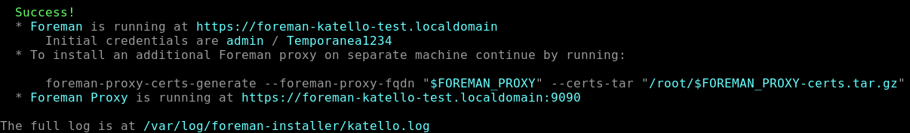

## Panoramica
Questa guida descrive l'installazione di **Foreman 3.15** con **Katello 4.17** e **Puppet 8** su **RHEL 9.x**. L'obiettivo finale è gestire il patch management di VM tramite SSH.


### Requisiti Hardware Minimi

| Componente                          | Minimo | Raccomandato |
| ----------------------------------- | ------ | ------------ |
| CPU                                 | 4 core | 8 core       |
| RAM                                 | 20 GB  | 32 GB        |
| Disco OS                            | 50 GB  | 100 GB       |
| Disco Pulp (`/var/lib/pulp`)        | 100 GB | 300+ GB      |
| Disco PostgreSQL (`/var/lib/pgsql`) | 20 GB  | 50 GB        |
### Architettura Target
### FOREMAN + KATELLO SERVER - (RHEL 9.6)   
##### Componenti:
- Foreman 3.15 
- Katello 4.17
- Puppet 8
- Pulp (Content Management)
- PostgreSQL
- Candlepin
##### Plugin Attivi:
- Remote Execution (SSH)
- Ansible

```
sda                     
 └─/var/lib/pulp
sdb 
 └─/var/lib/pgsql
sdc                     
 └─root
	├─/tmp
	├─/usr
	├─/home
	├─/var
``` 
---
## Indice 
- [[#FASE 1 : Verifica del Sistema]]
- [[#FASE 2: Configurazione NTP con Chrony]]
- [[#FASE 3: Configurazione Hostname e Networking]]
- [[#FASE 4: Configurazione Firewall]]
- [[#FASE 5: Configurazione Storage LVM per Pulp]]
	- [[#FASE 5-bis : Configurazione Storage LVM per PostgreSQL]]
- [[#FASE 6: Installazione Repository]]
- [[#FASE 7: Installazione Foreman-Katello]]
- [[#FASE 8: Verifica dell'Installazione]]
- [[#NEXT-STEP]]
- [[#EXTRA-LAB - Aggiungi Risoluzione DNS per gli Host]]
---
## FASE 1 : Verifica del Sistema
### 1.1 Verifica versione OS e SELinux
#### Verifica versione OS
```bash
cat /etc/os-release
```


#### Verifica versione SELinux policy
```bash
rpm -q selinux-policy
```

> **IMPORTANTE**: Foreman/Katello 4.17 richiede almeno `selinux-policy >= 38.1.45-3.el9_5`. Se la versione è inferiore (es. `38.1.35-2.el9_4`), è necessario aggiornare il sistema.
### 1.2 Registrazione RHEL e Aggiornamento Sistema
#### Diventa root
```bash
sudo su -
```
#### Registra la sottoscrizione RHEL
```bash
subscription-manager register
```
(Utilizzo della mie credenziali personali di RHEL per il momento)
#### Abilita i repository necessari
```bash
subscription-manager repos --enable=rhel-9-for-x86_64-baseos-rpms
```
```bash
subscription-manager repos --enable=rhel-9-for-x86_64-appstream-rpms
```
#### Aggiorna il sistema a RHEL 9.6
```bash
dnf upgrade --releasever=9.6 -y
```
#### Riavviare per applicare gli aggiornamenti
```bash
reboot
```
### 1.3 Verifica Post-Aggiornamento
#### Verifica che SELinux policy sia aggiornata
```bash
rpm -q selinux-policy
```

Output atteso: `selinux-policy-38.1.53-5.el9_6` o superiore.


---
## FASE 2: Configurazione NTP con Chrony

La sincronizzazione temporale è un componente **critico** per il corretto funzionamento di Katello e dei certificati SSL.
### 2.1 Installazione e Configurazione Chrony
#### Installa chrony
```bash
sudo su -
```
```bash
dnf install -y chrony
```
#### Abilita e avvia il servizio
```bash
systemctl enable --now chronyd
```
#### Verifica le sorgenti NTP
```bash
chronyc sources
```
#### Abilita NTP via timedatectl
```bash
timedatectl set-ntp true
```
#### Verifica lo stato sincronizzazione
```bash
timedatectl status
```

Output atteso:


---
## FASE 3: Configurazione Hostname e Networking
### 3.1 Identificare l'interfaccia di rete e l'IP
```bash
ip addr show
```

Annotare l'indirizzo IP dell'interfaccia principale (es. `eth0` o `ens192`).
### 3.2 Configura l'hostname
#### Imposta hostname (sostituisci con il tuo FQDN)
```bash
hostnamectl set-hostname foreman-katello-test.localdomain
```
#### Verifica hostname
```bash
hostname
```
```bash
hostname -f
```
### 3.3 Configura il file /etc/hosts
#### Backup del file hosts originale (backup)
```bash
cp /etc/hosts /etc/hosts.bak
```
#### Edita il file hosts
```bash
nano /etc/hosts
```

Aggiungi la seguente riga (sostituisci con i valori rilavati sopra):

```
10.172.2.15    foreman-katello-test.localdomain    foreman-katello-test
```

Il file dovrebbe apparire così:


### 3.4 Verifica la configurazione
#### Verifica risoluzione hostname
```bash
ping -c 2 $(hostname -f)
```

---
## FASE 4: Configurazione Firewall
### 4.1 Abilita le porte necessarie
#### Porte TCP per Foreman/Katello
```bash
firewall-cmd --add-port={53,80,443,5646,5647,8000,8140,9090}/tcp --permanent  
```
- 53/tcp   # DNS
- 80/tcp   # HTTP
- 443/tcp # HTTPS
- 5646/tcp # Qpid router
- 5647/tcp # Qpid router
- 8000/tcp # Anaconda
- 8140/tcp # Puppet
- 9090/tcp # Cockpit/Smart Proxy HTTPS
#### Porte UDP
```bash
firewall-cmd --add-port={53,67,68,69}/udp --permanent
```
- 53/udp # DNS
- 67/udp # DHCP
- 68/udp # DHCP
- 69/udp # TFTP
#### Servizi predefiniti
```bash
firewall-cmd --add-service={http,https,dns,dhcp,tftp,puppetmaster} --permanent
```
#### Applica le modifiche
```bash
firewall-cmd --reload
```
### 4.2 Verifica configurazione firewall
```bash
firewall-cmd --list-all
```

Output atteso:


---
## FASE 5: Configurazione Storage LVM per Pulp
Pulp richiede un volume dedicato montato su `/var/lib/pulp` per la gestione dei repository.
### 5.1 Identifica il disco dedicato

```bash
lsblk
```

Identifica il disco aggiuntivo (es. `/dev/sdb` o `/dev/sda` se non è il disco OS).

> **ATTENZIONE**: Assicurati di selezionare il disco corretto! Per non formattare il disco del sistema operativo.


### 5.2 Crea la struttura LVM

#### Crea tabella delle partizioni GPT (sostituisci /dev/sdb con il tuo disco)
```bash
parted /dev/sda --script mklabel gpt
```
#### Crea partizione primaria
```bash
parted /dev/sda --script mkpart primary 0% 100%
```
#### Crea Physical Volume
```bash
pvcreate /dev/sda1
```
#### Crea Volume Group
```bash
vgcreate vg_pulp /dev/sda1
```
#### Crea Logical Volume (usa tutto lo spazio disponibile)
```bash
lvcreate -l 100%FREE -n lv_pulp vg_pulp
```
### 5.3 Formatta e monta il volume
#### Formatta con filesystem XFS (raccomandato per Pulp)
```bash
mkfs.xfs /dev/mapper/vg_pulp-lv_pulp
```
#### Crea directory mount point
```bash
mkdir -p /var/lib/pulp
```
#### Monta il volume
```bash
mount /dev/mapper/vg_pulp-lv_pulp /var/lib/pulp
```
### 5.4 Configura mount persistente
#### Aggiungi entry in fstab per mount automatico al boot
```bash
echo "/dev/mapper/vg_pulp-lv_pulp /var/lib/pulp xfs defaults 0 0" >> /etc/fstab
```
#### Verifica la entry aggiunta
```bash
tail -n1 /etc/fstab
```

### 5.5 Ripristina contesto SELinux
#### Ripristina il contesto SELinux corretto per la directory
```bash
restorecon -Rv /var/lib/pulp/
```
### 5.6 Verifica il mount

```bash
df -hP /var/lib/pulp/
```

Output atteso:


#### Reload systemd per riconoscere le nuove configurazioni
```bash
systemctl daemon-reload
```
## FASE 5-bis : Configurazione Storage LVM per PostgreSQL
Stesso processo, device diverso (es. /dev/sdc)
```bash
parted /dev/sdb --script mklabel gpt
```
```bash
parted /dev/sdb --script mkpart primary 0% 100%
```
```bash
pvcreate /dev/sdb1
```
```bash
vgcreate vg_pgsql /dev/sdb1
```
```bash
lvcreate -l 100%FREE -n lv_pgsql vg_pgsql
```
```bash
mkfs.xfs /dev/mapper/vg_pgsql-lv_pgsql
```
```bash
mkdir -p /var/lib/pgsql
```
```bash
mount /dev/mapper/vg_pgsql-lv_pgsql /var/lib/pgsql
```
```bash
echo "/dev/mapper/vg_pgsql-lv_pgsql /var/lib/pgsql xfs defaults 0 0" >> /etc/fstab
```
```bash
restorecon -Rv /var/lib/pgsql/
```
```bash
df -hP /var/lib/pgsql/
```
```bash
systemctl daemon-reload
```
---
## FASE 6: Installazione Repository
### 6.1 Abilita CodeReady Builder e EPEL
#### Abilita CodeReady Linux Builder
```bash
subscription-manager repos --enable codeready-builder-for-rhel-9-$(arch)-rpms
```
#### Installa EPEL per RHEL 9
```bash
dnf install -y https://dl.fedoraproject.org/pub/epel/epel-release-latest-9.noarch.rpm
```
#### Abilita EPEL
```bash
dnf config-manager --set-enabled epel
```

### 6.2 Pulisci e aggiorna cache
Ora possiamo iniziare con l'installazione dei Foreman-Katello. Seguima dunque quanto riporato dalla guida per instllare verione di Foreman 3.15 Katello 4.17 e Puppet 8 https://docs.theforeman.org/3.15/Quickstart/index-katello.html
#### Pulisci tutti i metadati
```bash
dnf clean all
```
#### Aggiorna cache repository
```bash
dnf makecache
```
### 6.3 Installa repository Foreman, Katello e Puppet
#### Repository Foreman 3.15
```bash
dnf install -y https://yum.theforeman.org/releases/3.15/el9/x86_64/foreman-release.rpm
```
#### Repository Katello 4.17
```bash
dnf install -y https://yum.theforeman.org/katello/4.17/katello/el9/x86_64/katello-repos-latest.rpm
```
#### Repository Puppet 8
```bash
dnf install -y https://yum.puppet.com/puppet8-release-el-9.noarch.rpm
```
### 6.4 Verifica i repository abilitati

```bash
dnf repolist enabled
```

Output atteso:


---
## FASE 7: Installazione Foreman-Katello
### 7.1 Aggiorna il sistema
#### Aggiorna tutti i pacchetti prima dell'installazione
```bash
dnf upgrade -y
```
### 7.2 Installa il pacchetto installer
#### Installa foreman-installer per scenario Katello
```bash
dnf install -y foreman-installer-katello
```

### 7.3 Esegui l'installazione con plugin
Questa è l'installazione completa con tutti i plugin necessari individuati fino ad ora:

```bash
foreman-installer --scenario katello \
  --foreman-initial-admin-username admin \
  --foreman-initial-admin-password 'Temporanea1234' \
  --enable-foreman-plugin-remote-execution \
  --enable-foreman-proxy-plugin-remote-execution-script \
  --enable-foreman-plugin-ansible \
  --enable-foreman-proxy-plugin-ansible \
  --enable-foreman-plugin-templates \
  --enable-foreman-cli-katello \
  --foreman-proxy-registration true \
  --foreman-proxy-templates true
```

> **NOTA**: L'installazione richiede 15-30 minuti. Non interrompere il processo.

#### Opzioni installer spiegate:

| Opzione                                                 | Descrizione                                                   |
| ------------------------------------------------------- | ------------------------------------------------------------- |
| `--scenario katello`                                    | Installa Foreman con Katello                                  |
| `--foreman-initial-admin-username`                      | Username admin                                                |
| `--foreman-initial-admin-password`                      | Password admin                                                |
| `--enable-foreman-plugin-remote-execution`              | Esecuzione comandi via SSH                                    |
| `--enable-foreman-proxy-plugin-remote-execution-script` | Proxy per SSH                                                 |
| `--enable-foreman-plugin-ansible`                       | Integrazione Ansible                                          |
| `--enable-foreman-proxy-plugin-ansible`                 | Proxy per Ansible                                             |
| `--enable-foreman-plugin-templates`                     | Gestione template                                             |
| `--enable-foreman-cli-katello`                          | CLI hammer per Katello                                        |
| `--foreman-proxy-registration true`                     | **Feature Registration** (necessaria per Global Registration) |
| `--foreman-proxy-templates true`                        | **Feature Templates** (necessaria per Global Registration)    |

### 7.4 Monitora l'installazione (opzionale)
In un altro terminale puoi monitorare il log:

```bash
tail -f /var/log/foreman-installer/katello.log
```

### 7.5 Output installazione completata
Al termine dell'installazione vedrai un output simile:



---
## FASE 8: Verifica dell'Installazione
### 8.1 Verifica stato servizi
#### Verifica stato di tutti i servizi Katello
```bash
foreman-maintain service status
```
### 8.2 Verifica accesso web

Apri un browser e accedi a:

- **URL**: `https://foreman-katello.localdomain` (o l'IP del server: `https://10.172.2.15`)
- **Username**: `admin`
- **Password**: `Temporanea1234` (o quella specificata durante l'installazione)

> **NOTA**: Se il browser mostra un avviso certificato, è normale (certificato self-signed). Procedi accettando il rischio.


### 8.3 Recupera credenziali (se necessario)
Se hai dimenticato la password:

```bash
grep admin_password /etc/foreman-installer/scenarios.d/katello-answers.yaml
```
### 8.4 Test CLI Hammer
#### Login con hammer
```bash
hammer auth login basic --username admin --password 'Temporanea1234'
```
#### Verifica utenti
```bash
hammer user list
```
#### Verifica organizzazioni
```bash
hammer organization list
```
#### Verifica locations
```bash
hammer location list
```
### 8.5 Verificare i plugin attivi
#### Via RPM
```bash
rpm -qa | grep -E "rubygem-foreman_|foreman-plugin"
```


#### Via Web UI
##### Administer → About → Scorri fino a "Plugins" e vedrai la lista completa con versioni.


---
### Ambiente di Riferimento

| Componente       | Valore                           |
| ---------------- | -------------------------------- |
| Server Foreman   | foreman-katello-test.localdomain |
| Organization     | PSN-ASL06                        |
| Location         | Italy-North                      |
| VM Ubuntu Target | 10.172.2.5                       |
| OS Target        | Ubuntu 24.04 LTS                 |
## NEXT-STEP
- [Configurazione Organization e Location](Settings/Configurazione-Organization-e-Location.md)
- [Configurazione Content Credentials (Chiavi GPG)](Configurazione-Content-Credentials.md)
- [Creazione Product e Repository Ubuntu 24.04](Settings/Creazione-Product-Repository-Ubuntu-24.04.md)
- [Lifecycle Environments](Settings/Lifecycle-Environments.md)
- [Content View](Settings/Content-View.md)
- [Operating System](Settings/Operating-System.md)
- [Host Group](Settings/Host-Group.md)
- [Activation Key](Settings/Activation-Key.md)
- [Guida Registrazione Host Ubuntu 24.04](Settings/Guida-Registrazione-Host-Ubuntu-24.04.md)

---
## Riferimenti

- [Documentazione ufficiale Foreman 3.15](https://docs.theforeman.org/3.15/)
- [Documentazione Katello](https://docs.theforeman.org/3.15/Quickstart/index-katello.html)
- [Foreman Remote Execution](https://docs.theforeman.org/3.15/Managing_Hosts/index-katello.html#Configuring_and_Setting_Up_Remote_Jobs_managing-hosts)
- [ATIX subscription-manager per Ubuntu](https://oss.atix.de/html/ubuntu.html)

---
## EXTRA-LAB - Aggiungi Risoluzione DNS per gli Host

Per ogni host che registrerai, aggiungi una entry in `/etc/hosts` sul server Foreman.

**Formato:**

```bash
echo "IP_HOST    HOSTNAME_HOST" >> /etc/hosts
```

**Esempio per il primo host:**

```bash
echo "10.172.2.15    test-vm-production" >> /etc/hosts
```

**IMPORTANTE**: Questo passaggio va ripetuto per OGNI nuovo host che registri. Il nome deve corrispondere a quello usato in `subscription-manager register --name="..."`.

### Verifica

```bash
ping -c 2 test-vm-production
```
