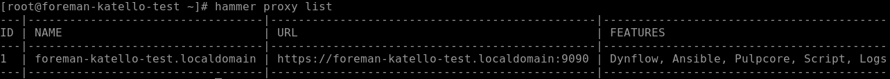
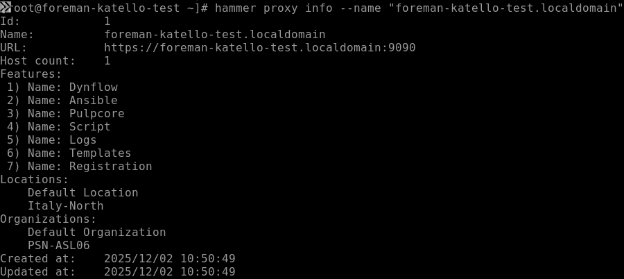
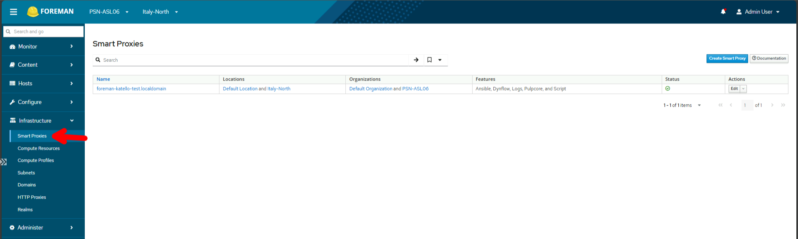

## 1 - Configurazione Post-Installazione
### Configura Organization e Location
#### L'organizzazione di default è già creata, ma puoi crearne altre
```bash
hammer organization create --name "PSN-ASL06" --label "psnasl06"
```
#### Crea location per il tuo ambiente Azure
```bash
hammer location create --name "Italy-North"
```
#### Associa location all'organizzazione
```bash
hammer organization add-location --name "PSN-ASL06" --location "Italy-North"
```
### 1.1 - Verifica plugin Remote Execution
#### Verifica che il plugin REX sia attivo
```bash
hammer settings list | grep remote_execution
```

Le impostazioni chiave sono:

| Setting                                  | Valore                           | Significato               |
| ---------------------------------------- | -------------------------------- | ------------------------- |
| `remote_execution_ssh_user`              | **root**                         | Connessione SSH come root |
| `remote_execution_ssh_port`              | **22**                           | Porta standard SSH        |
| `remote_execution_effective_user`        | **root**                         | Esegue comandi come root  |
| `remote_execution_effective_user_method` | **sudo**                         | Usa sudo se necessario    |
| `remote_execution_global_proxy`          | **true**                         | Cerca proxy disponibili   |
| `remote_execution_form_job_template`     | **Run Command - Script Default** | Template default pronto   |
#### Verifica la chiave SSH di Foreman
```bash
cat /var/lib/foreman-proxy/ssh/id_rsa_foreman_proxy.pub
```

> **IMPORTANTE**: Questa chiave pubblica dovrà essere copiata sulle VM Ubuntu chesi vogliono gestire.

### 1.2 Verifica Smart Proxy esistente
#### Lista gli Smart Proxy disponibili
```bash
hammer proxy list
```
Output atteso:


### 1.3 Associa Smart Proxy all'Organization e alla Location
#### Associa il proxy all'organizzazione PSN-ASL06
```bash
hammer organization add-smart-proxy \
  --name "PSN-ASL06" \
  --smart-proxy "foreman-katello-test.localdomain"
```
#### Associa il proxy alla location Italy-North
```bash
hammer location add-smart-proxy \
  --name "Italy-North" \
  --smart-proxy "foreman-katello-test.localdomain"
```
### 1.3 Verifica Smart Proxy features
```bash
hammer proxy info --name "foreman-katello-test.localdomain"
```
Guarda la sezione "Features". Dovresti vedere in Active features:


### Refresh features (se necessario)
```bash
hammer proxy refresh-features --name "foreman-katello-test.localdomain"
```
### 1.4 Verifica associazioni
#### Verifica Organization
```bash
hammer organization info --name "PSN-ASL06"
```

#### Verifica dalla Web UI andando **Infrastructure → Smart Proxies**



1. Vai su **Administer → Organizations → PSN-ASL06 → Smart Proxies**
2. Verifica che `foreman-katello-test.localdomain` sia presente
3. Ripeti per **Administer → Locations → Italy-North → Smart Proxies**

---
# Prerequisiti e Correzioni Server Foreman

Questa guida contiene tutte le configurazioni da eseguire **UNA SOLA VOLTA** sul server Foreman prima di registrare host Ubuntu. Se hai già eseguito questi passaggi, passa direttamente alla guida di registrazione host.

---

## 2. Verifiche varie
L'organizzazione deve avere la Location associata, altrimenti non potrai assegnare gli host alla Location corretta.
```bash
hammer organization info --name "PSN-ASL06" | grep -i location
```
#### Se "Italy-North" non è elencata, associala
```bash
hammer organization add-location --name "PSN-ASL06" --location "Italy-North"
```
---
## 2.1 Verifica Label dell'Organizzazione

**IMPORTANTE**: `subscription-manager` usa il **Label** dell'organizzazione, NON il nome.
```bash
hammer organization list
```
---
## 2.2 Verifica Activation Key

```bash
hammer activation-key list --organization "PSN-ASL06"
```
---
## 2.3 Verifica Content View e Repository

#### Content View
```bash
hammer content-view list --organization "PSN-ASL06"
```
#### Repository sincronizzati
```bash
hammer repository list --organization "PSN-ASL06"
```
---
## 2.4 Verifica Chiave SSH di Foreman Proxy

```bash
ls -la /var/lib/foreman-proxy/ssh/
```
**Output atteso:**
```
id_rsa_foreman_proxy
id_rsa_foreman_proxy.pub
```
Se non esistono, rigenera:
```bash
foreman-installer --foreman-proxy-plugin-remote-execution-script-generate-keys true
```
### Visualizza la chiave pubblica (servirà per ogni host)

```bash
cat /var/lib/foreman-proxy/ssh/id_rsa_foreman_proxy.pub
```

